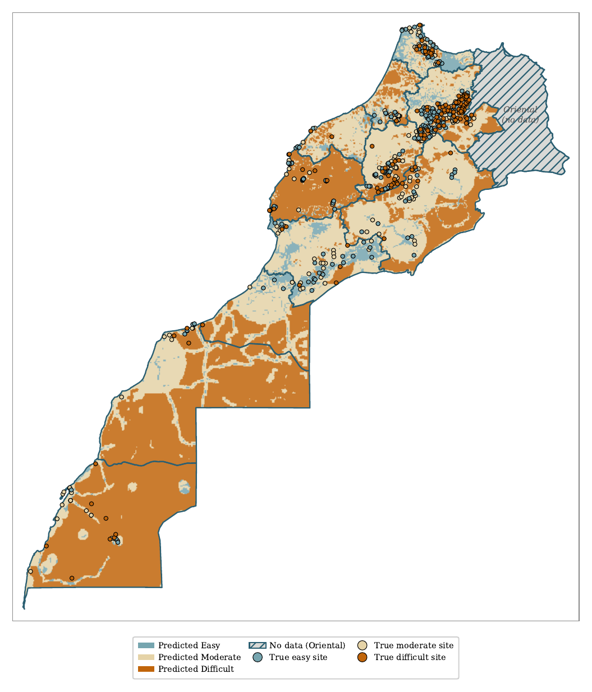
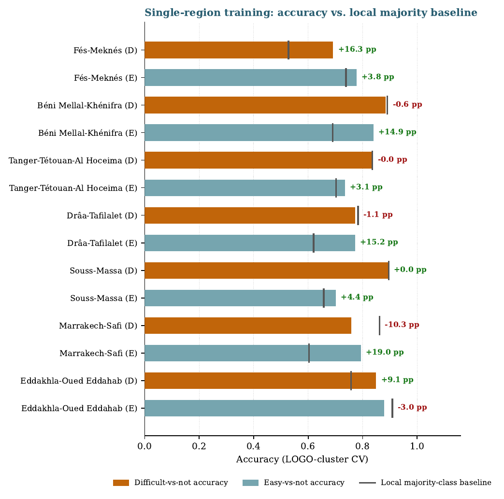

  

# Geosite Accessibility Modeling — Morocco

Machine-learning assessment of physical accessibility for Morocco's geoheritage sites
(geosites), built at the Geology and Sustainable Mining Institute (GSMI), UM6P. The
catalog spans **1,667 geosites** across all eleven administrative regions with labeled
sites, of which **939** carry an independently-sourced, citation-traceable accessibility
label (*Easy* / *Moderate* / *Difficult*) -- 733 from the original inventory plus 206
added and fully audited in a second labeling pass.

Two companion papers cover the work: a national review
([`report/geosite_ai_section_2026.pdf`](report/geosite_ai_section_2026.pdf)) and a
regional comparison
([`report/geosite_ai_section_2026_paper2_regional.pdf`](report/geosite_ai_section_2026_paper2_regional.pdf)).

## Results at a glance

| Model | *N* | Validation | Metric | Value |
|---|---:|---|---|---:|
| Geosite-location favorability | 1,667 | Spatial block CV | AUC | **0.956** |
| Guelmim-Oued Noun + Laâyoune (Easy vs. not) | 22 | 500m LOGO-cluster CV | Accuracy | **90.9%** (+31.8pp vs. local baseline) |
| Souss-Massa (Difficult vs. not) | 67 | 500m LOGO-cluster CV | Accuracy | 89.6% |
| Béni Mellal-Khénifra (Difficult vs. not) | 174 | 500m LOGO-cluster CV | Accuracy | 88.5% |
| Eddakhla-Oued Eddahab (Easy vs. not) | 33 | 500m LOGO-cluster CV | Accuracy | 87.9% |
| National (Difficult vs. not) | 939 | 500m LOGO-cluster CV | Accuracy | 74.9% |
| National (Easy vs. not) | 939 | 500m LOGO-cluster CV | Accuracy | 71.7% |
| National (3-class Easy/Moderate/Difficult) | 939 | 500m LOGO-cluster CV | Accuracy | 56.2% |

Every model uses the same core terrain/infrastructure feature stack (slope, ruggedness,
elevation, distance to highway, distance to settlement, land-cover friction --
regionally, extended with geological-domain or tourism-infrastructure features when
that beats the baseline) and a 500m haversine-clustered leave-one-group-out CV
protocol throughout, specifically to avoid the near-duplicate-site leakage that
inflates naive random-split accuracy in spatial data. National numbers are checked
against a paired McNemar test; regional numbers are reported against each region's
own local majority-class baseline (see the regional paper for the full 20-row
region-by-region breakdown, including the five region/target combinations that do
*not* clear their local baseline).

  
  &nbsp;&nbsp;
  

  
  &nbsp;&nbsp;
  

<em>Top left: national accessibility projection (pooled model). Top right: predicted
geosite-location favorability -- where terrain/geology resembles known geosite
locations, not accessibility. Bottom left: regional paper's national mosaic, assembled
from per-region best models. Bottom right: single-region accuracy vs. each region's own
local majority baseline, gap labeled.</em>

Full-resolution figures: [`report/figures/`](report/figures/).

## Repository structure

The pipeline runs in three numbered stages, each in its own top-level folder,
meant to be run in order:

| Path | Contents |
|---|---|
| [`01_data_preparation/`](01_data_preparation/) | Catalog build: ingest the two supervisor-provided source batches, extract terrain/road/settlement features, merge into the final catalog, build the master Excel, train the favorability model, run the model-family battery. Run `01`→`10` in order; `_catalog_helpers.py` is a shared library, not a step. `historical_one_shot_migrations/` documents three one-off column additions (Copernicus DEM, WorldCover LULC, settlement distance) already baked into `data/final/` — **not rerunnable**, their source inputs no longer exist; kept for provenance only. |
| [`02_modeling_and_analysis/`](02_modeling_and_analysis/) | Modeling, statistical testing, and calibration/conformal analysis. See its own [`README.md`](02_modeling_and_analysis/README.md) for run order — `01`/`02` are audit-trail records, `03`–`29` are the live pipeline. |
| [`03_report_generation/`](03_report_generation/) | Figure/map rendering scripts for both papers and the presentation. |
| [`report/`](report/) | The written deliverables — `geosite_ai_section_2026.tex`/`.pdf` (national review), `geosite_ai_section_2026_paper2_regional.tex`/`.pdf` (regional comparison), their figures (`figures/`), and the UM6P/GSMI logo (`um6p_figures/`). Both `.tex` files compile as-is from this folder. |
| [`presentation/`](presentation/) | French wrap-up slide deck (Beamer), `wrapup.tex`/`.pdf`. |
| [`data/`](data/) | `final/` — the labeled catalog and dataset used throughout (join key: `Locality_ID`). `model_outputs/` — hyperparameter search results, prediction grids, favorability output. `boundaries/` — region GeoJSON boundaries used for map rendering. |
| [`models/final/`](models/final/) | The deployed favorability model (`geosite_location_pilot_model_v4.joblib`). |
| [`models/experimental/`](models/experimental/) *(gitignored)* | Earlier model iterations, kept locally for provenance, not tracked in git. |
| [`references/`](references/) | `databases/` — the source Excel/CSV geoheritage databases. `articles/` — cited papers (two large third-party copyrighted PDFs are gitignored, not redistributed). |
| [`results/`](results/) | Raw experiment outputs (JSON/CSV) that `02_modeling_and_analysis/` and `03_report_generation/` scripts read and write. |
| [`exploration/`](exploration/) | Side investigations not part of the reported pipeline: HDBSCAN clustering (`hdbscan/`) and the favorability-v3 notebook (`notebooks/`). |
| `archive/`, `livrable/` *(gitignored)* | `archive/superseded_scripts/` — ~25 dead-end/superseded scripts kept for history, see its `README.md`. `livrable/` — a standalone, self-contained handoff copy of the deliverable for the supervisors (rebuild with the same folder set as above, minus `archive/`/`exploration/`). Both kept locally, not pushed. |

## Reproduction

1. `01_data_preparation/` in numeric order (skip `historical_one_shot_migrations/`).
2. `02_modeling_and_analysis/` in numeric order (skip `01`/`02`).
3. `03_report_generation/*.py` to regenerate figures/maps, then compile either
   `.tex` in `report/` with `pdflatex` (run twice, for cross-references).

Each script locates the repo root via `os.path.dirname(os.path.abspath(__file__))`
plus a fixed number of `..` segments — keep the directory layout above intact.

## Methodology, in one paragraph

939 labeled geosites (733 from the original citation-traceable inventory, plus 206
added and fully audited in a second labeling pass), six core terrain/infrastructure
features common to every model: slope, ruggedness, elevation (Copernicus GLO-30 DEM),
distance to highway (OSM), distance to settlement (haversine to 55 reference cities),
and land-cover friction (ESA WorldCover). Deployed model: a four-member soft-voted
tree ensemble (Random Forest + XGBoost + Gradient Boosting + LightGBM), class-balance-
weighted. Three additional, structurally unrelated model families (a linear baseline,
*k*-NN, and a Gaussian Process classifier) were tested under the same 500m LOGO-cluster
protocol as a baseline-choice justification — none displaces the tree ensemble by a
statistically confirmed margin. National binary accuracy (74.9% Difficult, 71.7% Easy)
is numerically above the majority-class baseline but not statistically distinguishable
from it by a paired McNemar test; a three-class model reaches 56.2% and edges out the
two-binary-classifier combination it was previously thought to underperform, though
only borderline significantly ($p=0.075$). A newly added tourism-infrastructure
feature does clear that bar for the Easy classifier ($p=0.029$). Split-conformal
prediction reframes the deliverable from a single accuracy number to a calibrated
confidence statement: a confident call for roughly six in ten sites, an explicit
field-verification flag for the rest. A companion geosite-location favorability model
(AUC 0.956, full 1,667-site catalog) answers a related, distinct question — where
currently uncatalogued geosites are likely to be found. A full per-region breakdown,
including which feature set and region-merging strategy works best where, is the
dedicated subject of the regional companion paper. Full detail and honest discussion
of limitations:
[`report/geosite_ai_section_2026.pdf`](report/geosite_ai_section_2026.pdf) and
[`report/geosite_ai_section_2026_paper2_regional.pdf`](report/geosite_ai_section_2026_paper2_regional.pdf).

## Acknowledgments

Work developed by [Mohamed El Gorrim](https://github.com/MedGm) under the supervision of Dr. Ismail Ben Amar , Mohamed El Ouali and Sanae El Harche at the Geology and Sustainable Mining Institute (GSMI), UM6P, as part of the UM6P AI/ML internship program.