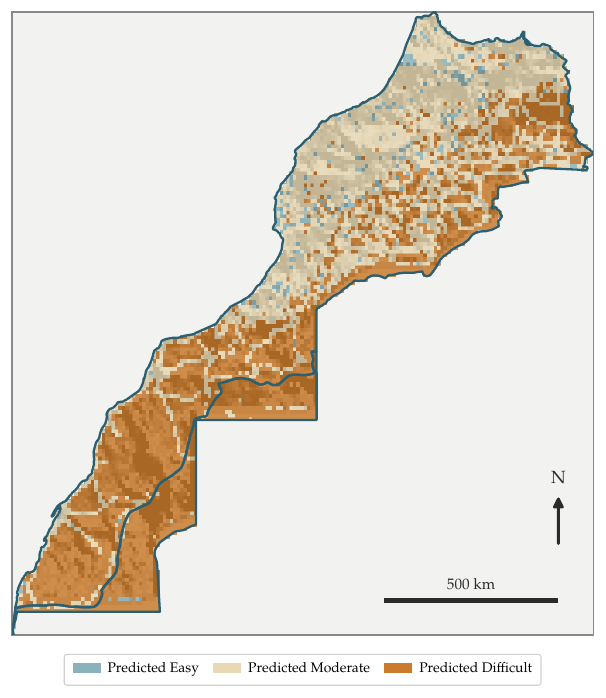
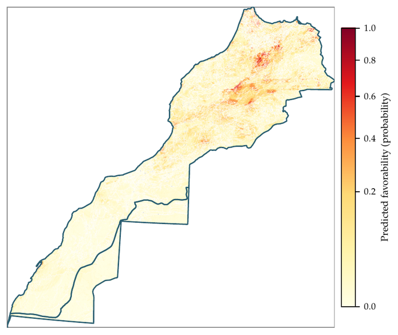

  

# Geosite Accessibility Modeling — Morocco

Machine-learning assessment of physical accessibility for Morocco's geoheritage sites
(geosites), built at the Geology and Sustainable Mining Institute (GSMI), UM6P. The
catalog spans **1,667 geosites** across all eleven administrative regions, of which
**733** carry an independently-sourced, citation-traceable accessibility label
(*Easy* / *Moderate* / *Difficult*).

Full methodology, validation protocol, and discussion: [`report/geosite_ai_section_2026.pdf`](report/geosite_ai_section_2026.pdf).

## Results at a glance

| Model | *N* | Validation | Metric | Value |
|---|---:|---|---|---:|
| Eddakhla-Oued Eddahab (Difficult vs. not) | 25 | Leave-region-out | Accuracy | **96.0%** |
| Geosite-location favorability | 1,667 | Spatial block CV | AUC | **0.956** |
| Fés-Meknés (Easy vs. not) | 322 | 500m LOGO-cluster CV | Accuracy | 78.6% |
| Béni Mellal-Khénifra (Easy vs. not) | 157 | 500m LOGO-cluster CV | Accuracy | 77.7% |
| National (Difficult vs. not) | 733 | 500m LOGO-cluster CV | Accuracy | 74.1% |
| National (Easy vs. not) | 733 | 500m LOGO-cluster CV | Accuracy | 73.3% |

Every model uses the same six terrain/infrastructure features (slope, ruggedness,
elevation, distance to highway, distance to settlement, land-cover friction) and a
500m haversine-clustered leave-one-group-out CV protocol, specifically to avoid the
near-duplicate-site leakage that inflates naive random-split accuracy in spatial data.

  
  &nbsp;&nbsp;
  

<em>Left: national accessibility projection (500m LOGO-cluster model). Right: predicted geosite-location favorability — where terrain/geology resembles known geosite locations, not accessibility.</em>

## Repository structure

| Path | Contents |
|---|---|
| [`report/`](report/) | The written deliverable — `geosite_ai_section_2026.tex`/`.pdf`, its figures (`figures/`), the rendering scripts that produce them (`scripts/`), and the UM6P/GSMI logo (`um6p_figures/`). Self-contained: the `.tex` compiles as-is from this folder. |
| [`presentation/`](presentation/) | French wrap-up slide deck (Beamer), `wrapup.tex`/`.pdf`. |
| [`data/`](data/) | `final/` — the labeled catalog and dataset used throughout (join key: `Locality_ID`). `model_outputs/` — hyperparameter search results, prediction grids, favorability output. `boundaries/` — region GeoJSON boundaries used for map rendering. `newdb_v2/`, `newdb_v2_aug16/` — the Aug-2026 catalog-expansion ingestion intermediates (two batches: Aug-9 and Aug-16). |
| [`code/`](code/) | The full numbered pipeline, `01`–`34`, in run order — catalog consolidation through the day's follow-up experiments (mixed-effects region modeling, calibration/conformal prediction, second catalog expansion). See each script's docstring for what it does and what it reads/writes. |
| [`models/final/`](models/final/) | The one model actually loaded by any current script: the geosite-favorability model (AUC 0.956) behind the favorability map. |
| [`models/experimental/`](models/experimental/) *(gitignored)* | 21 earlier model iterations (including the superseded favorability v3), kept locally for provenance, not tracked in git. |
| [`references/`](references/) | `databases/` — the source Excel/CSV geoheritage databases. `articles/` — cited papers (two large third-party copyrighted PDFs are gitignored, not redistributed). |
| [`results/`](results/) | Raw experiment battery outputs (`results/scripts/compute_derived_numbers.py` derives the report's numbers from these). |
| [`notebooks/`](notebooks/) | Exploratory notebooks. |
| `cards_and_rasters/`, `archive/`, `livrable/` *(gitignored)* | Large raster basemaps, superseded/historical material, and a standalone handoff copy of the deliverable — all kept locally, not pushed. |

## Methodology, in one paragraph

Six features, common to every model: slope, ruggedness, elevation (Copernicus GLO-30
DEM), distance to highway (OSM), distance to settlement (haversine to 55 reference
cities), and land-cover friction (ESA WorldCover). Deployed model: a four-member
soft-voted tree ensemble (Random Forest + XGBoost + Gradient Boosting + LightGBM),
confidence- and class-balance-weighted. Five structurally different model families
(logistic regression, two forms of *k*-NN, Gaussian Process, tree ensemble) were
compared under the identical protocol as an internal check — none beat the tree
ensemble by a meaningful margin, confirming a feature-set ceiling rather than an
algorithm-choice problem. Full detail, per-region results, and honest discussion of
limitations: [`report/geosite_ai_section_2026.pdf`](report/geosite_ai_section_2026.pdf).

## Acknowledgments

Work developed by [Mohamed El Gorrim](https://github.com/MedGm) under the supervision of Dr. Ismail Ben Amar , Mohamed El Ouali and Sanae El Harche at the Geology and Sustainable Mining Institute (GSMI), UM6P, as part of the UM6P AI/ML internship program.